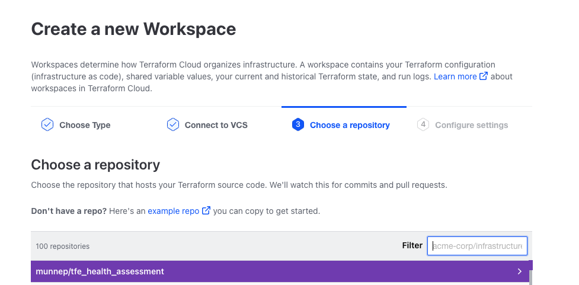
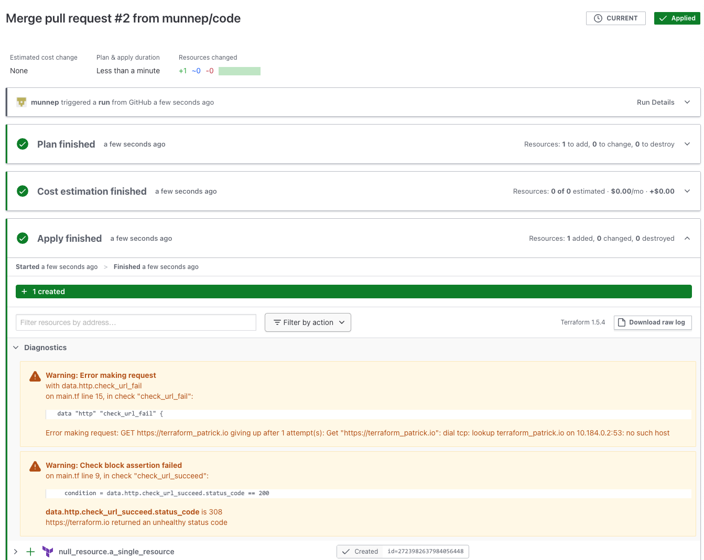
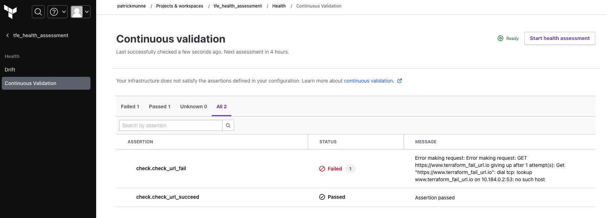

# Terraform Enterprise Health Assessment

Terraform Enterprise/Terraform Cloud have the option of a Health Assessment on workspaces. This is divided into 2 things

Drift detection determines whether your real-world infrastructure matches your Terraform state file.

Continuous validation determines whether custom conditions in the workspace’s configuration continue to pass after Terraform provisions the infrastructure.

[Link to the official documentation](https://developer.hashicorp.com/terraform/cloud-docs/workspaces/health)

In this repo we will create a workspace that uses this repository with a Health Check Assessment

# How to

- Fork this repository to your own environment
- Create a new workspace in TFE/TFC and point to this forked repository  
  
- enable the health assesments by going to the workspace -> Settings -> Health -> Enable  
  
- Start a new run and apply the code
- This will succeed but with a message that one of the check blocks failed as expected
  
- On the workspace you can now go to health 
- You can do a health assessment and it will do another run and show 1 failed and 1 passed check
  
